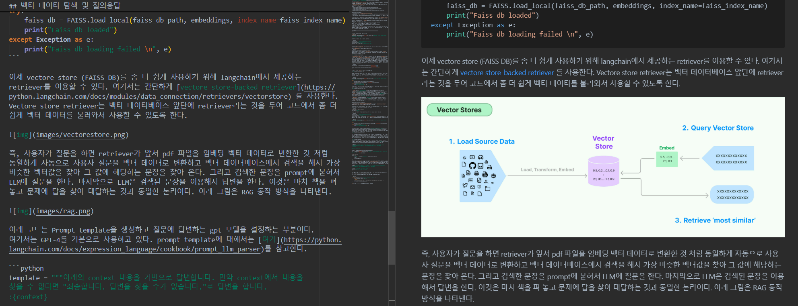
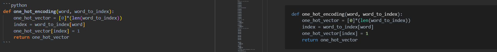

# Markdown 작성법
README.md 파일과 같이 .md 파일을 마크다운 파일이라고 한다. 현재 이글도 마크다운 언어로 작성되고 있으며 마크다운 언어에 대해 좀더 알고 싶다면 아래 링크를 참고할 수 있다.

- 나무위키: https://namu.wiki/w/%EB%A7%88%ED%81%AC%EB%8B%A4%EC%9A%B4
- Markdownguide.org: https://www.markdownguide.org/

특히 VSCODE와 같이 Preview 기능이 있는 도구를 사용하여 작성중에 바로 화면에 표시되는 모습을 확인할 수 있다.



**목차**

- [장점](#장점)
- [단점](#단점)
- [제목(Header)](#제목)
- [문단](#문단)
- [줄바꿈](#줄바꿈)
- [강조(Bold)](#강조bold)
- [강조(Italic)](#강조italic)
- [강조(Italc&Bold)](#강조bold와-italic-함께쓰기)
- [인용구](#인용구-추가)
- [목록](#목록)
- [코드 블럭](#코드-블럭)
- [이미지](#이미지)
- [링크](#링크)
- [표(table)](#표table)

## 장점
- 문법이 배우기 쉽고 간결하여 관리하기 쉽다.
- 별도의 도구 없이도 작성이 가능하다. 아무 메모장에서 작성 후 md파이롤 저장만 하면 된다.
- 텍스트로 저장되기 때문에 용량이 적다.

## 단점
- 표준이 없는 것이 단점이 될 수 있다. 표준이 없어 표현하는 도구에 따라 다르게 보일 수 있다.
- 모든 HTML을 대신하지는 못한다.

## 제목(Header)
`#` 뒤에 띄어쓰기를 해주어 표시한다.
```
# Heading level 1
## Heading level 2
### Heading level 3
#### Heading level 4
##### Heading level 5
###### Heading level 6
```

# Heading level 1
## Heading level 2
### Heading level 3
#### Heading level 4
##### Heading level 5
###### Heading level 6

## 문단
문단을 만들기 위해 빈칸을 사용한다.
```
I really like using Markdown.

I think I'll use it to format all of my documents from now on.
```
I really like using Markdown.

I think I'll use it to format all of my documents from now on.

## 줄바꿈
줄바꿈을 위해 문장뒤에 띄어쓰기 두번을 추가하거나 `<br/>`을 추가한다.
```
This is the first line.  
And this is the second line.
```
This is the first line.  
And this is the second line.

## 강조(Bold)
글자를 강조하기 위해 굵게 표시할 경우 `**` 또는 `__`를 단어 앞뒤에 추가한다.
```
I just love **bold text**.
I just love __bold text__.
```
I just love **bold text**.  
I just love __bold text__.

## 강조(Italic)
글자를 이태릭체로 표시하기 위해 `*` 또는 `_`를 단어 앞뒤에 추가한다.
```
Italicized text is the *cat's meow*.
Italicized text is the _cat's meow_.
```
Italicized text is the *cat's meow*.  
Italicized text is the _cat's meow_.

## 강조(Bold와 Italic 함께쓰기)
```
This text is ***really important***.
This text is ___really important___.
This text is __*really important*__.
This text is **_really important_**.
This is really***very***important text.
```
This text is ***really important***.  
This text is ___really important___.  
This text is __*really important*__.  
This text is **_really important_**.  
This is really ***very*** important text.

## 인용구 추가
`>`를 사용하여 인용구를 추가할 수 있다.
```
> Dorothy followed her through many of the beautiful rooms in her castle.
```
> Dorothy followed her through many of the beautiful rooms in her castle.

여러 문장을 인용구에 추가할 수 있다.
```
> Dorothy followed her through many of the beautiful rooms in her castle.
>
> The Witch bade her clean the pots and kettles and sweep the floor and keep the fire fed with wood.
```
> Dorothy followed her through many of the beautiful rooms in her castle.
>
> The Witch bade her clean the pots and kettles and sweep the floor and keep the fire fed with wood.

인용구 안에 또 다른 인용구를 포함할 수 있다.
```
> Dorothy followed her through many of the beautiful rooms in her castle.
>
>> The Witch bade her clean the pots and kettles and sweep the floor and keep the fire fed with wood.
```
> Dorothy followed her through many of the beautiful rooms in her castle.
>
>> The Witch bade her clean the pots and kettles and sweep the floor and keep the fire fed with wood.

인용구안에 다른 마크다운 문법을 혼용해서 사용할 수 있다.
```
> #### The quarterly results look great!
>
> - Revenue was off the chart.
> - Profits were higher than ever.
>
>  *Everything* is going according to **plan**.
```

> #### The quarterly results look great!
>
> - Revenue was off the chart.
> - Profits were higher than ever.
>
>  *Everything* is going according to **plan**.

## 목록
순서가 있는 목록은 다음과 같이 표시한다.
```
1. First item
2. Second item
3. Third item
4. Fourth item
```
1. First item
2. Second item
3. Third item
4. Fourth item

사실 번호는 아무런 의미가 없다.
```
1. First item
8. Second item
3. Third item
5. Fourth item
```
1. First item
8. Second item
3. Third item
5. Fourth item
```
1. First item
1. Second item
1. Third item
1. Fourth item
```
1. First item
1. Second item
1. Third item
1. Fourth item

다중 나열은 다음과 같다.
```
1. First item
2. Second item
3. Third item
    1. Indented item
    2. Indented item
4. Fourth item
```
1. First item
2. Second item
3. Third item
    1. Indented item
    2. Indented item
4. Fourth item

순서가 없는 목록은 다음과 같이 표시한다.
```
- First item
- Second item
- Third item
- Fourth item
```
- First item
- Second item
- Third item
- Fourth item

```
* First item
* Second item
* Third item
* Fourth item
```
* First item
* Second item
* Third item
* Fourth item


```
- First item
- Second item
- Third item
    - Indented item
    - Indented item
- Fourth item
```
- First item
- Second item
- Third item
    - Indented item
    - Indented item
- Fourth item

만약 목록에 숫자로 시작하는 문장이 있다면 다음과 같이 표시한다.
```
- 1968\. A great year!
- I think 1969 was second best.
```
- 1968\. A great year!
- I think 1969 was second best.

목록에 문단을 추가하는 방법은 다음과 같다.
```
* This is the first list item.
* Here's the second list item.

    I need to add another paragraph below the second list item.

* And here's the third list item.
```
* This is the first list item.
* Here's the second list item.

    I need to add another paragraph below the second list item.

* And here's the third list item.

인용구를 추가하는 방법은 다음과 같다.
```
* This is the first list item.
* Here's the second list item.

    > A blockquote would look great below the second list item.

* And here's the third list item.
```
* This is the first list item.
* Here's the second list item.

    > A blockquote would look great below the second list item.

* And here's the third list item.

## 코드 블럭
인라인코드는 백틱(`)으로 코드를 감싼다.
```
`code`는 코드이다.
```
`code`는 코드이다.

블럭코드는 다음과 같이 표시하며 ```뒤에 언어종류를 추가할 경우 해당 언어에 맞게 하이라이트 된다. python, bash, plaintext, html, css, javascript 등이 올 수 있다.



## 이미지
아래와 같이 해당 이미지 위치를 지정하여 표시할 수 있다. ``
```


```


만약 해당 이미지가 없다면 `대체텍스트` 문구가 표시된다.

## 링크
링크는 `[링크이름](주소)`와 같이 표시할 수 있다.
```
[마크다운홈페이지](https://www.markdownguide.org/)
```
[마크다운홈페이지](https://www.markdownguide.org/)

## 수평선
아래와 같이 표시하여 수평선을 생성할 수 있다.
```
***

---

_________________
```

***

---

_________________

## 표(table)
`|` (vertical bar)를 이용하여 간단한 표를 작성할 수 있다. 헤더와 셀을 구분할때 3개 이상의 하이픈(---)을 추가한다. 그리고 콜론(:)을 추가하여 정렬할 수 있다.
```
| 구분 | value | Description |
| --- | --- | ---- |
| 정렬 | --: | 우측정렬 |
| 정렬 | :-- | 좌측정렬 |
| 정렬 | :--: | 가운데정렬 |
```

| 구분 | value | Description |
| --- | --- | ---- |
| 정렬 | --: | 우측정렬 |
| 정렬 | :-- | 좌측정렬 |
| 정렬 | :--: | 가운데정렬 |

